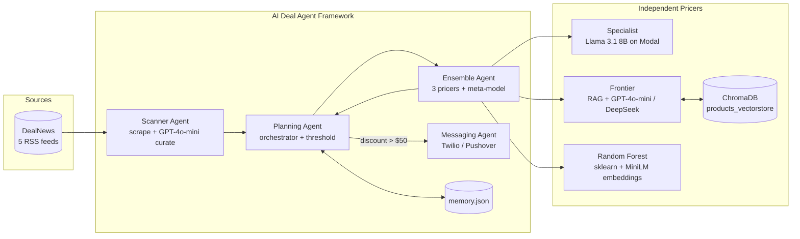
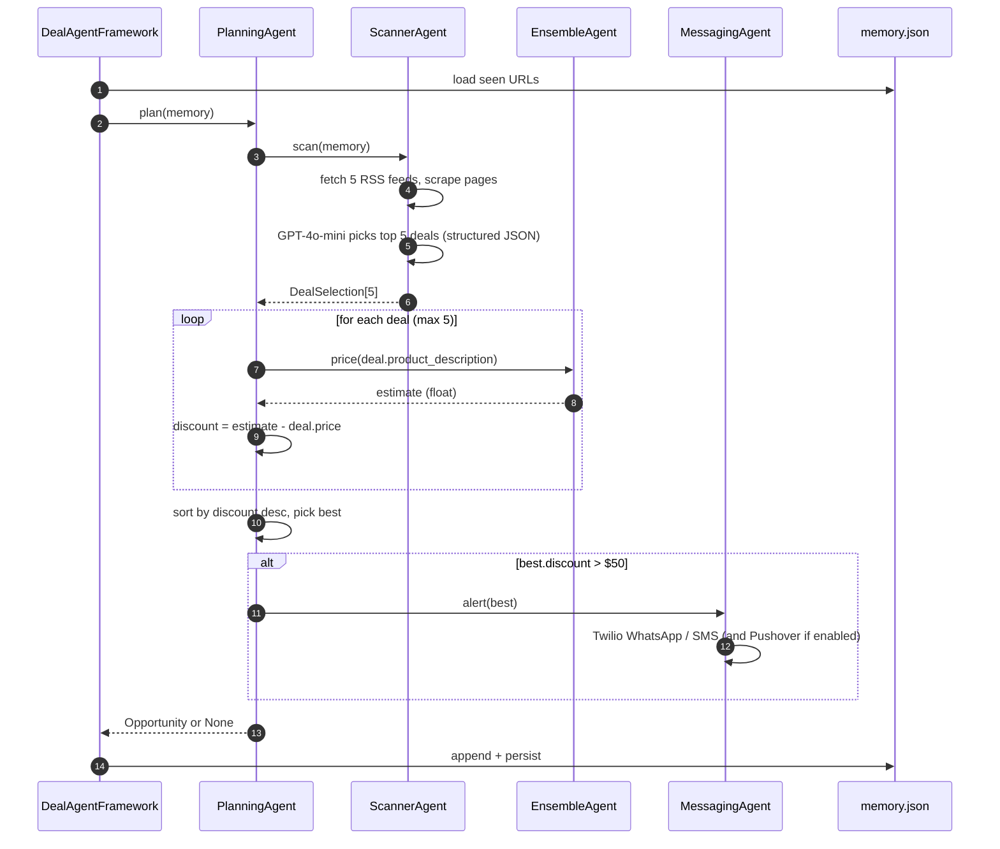
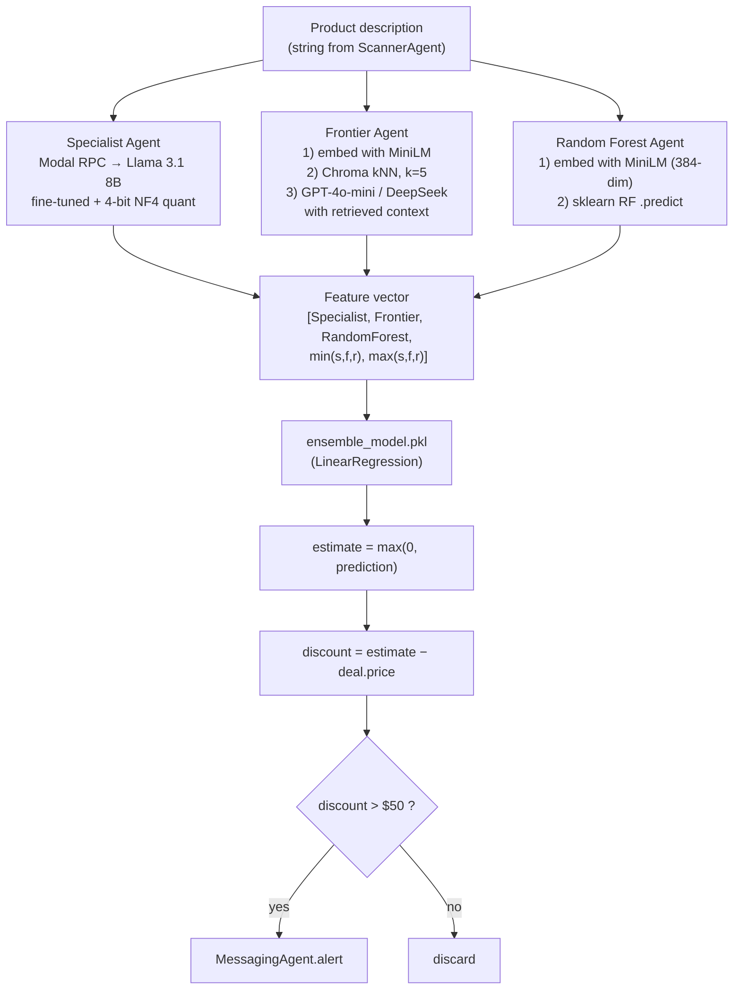

# AI Deal Agent Framework

> A multi-agent system that scans deal feeds, estimates fair prices with an ensemble of three independent ML/LLM models, and alerts you only when the **estimated value − listed price > $50**.

It does in seconds what a careful human would spend hours doing: read a deal, mentally compare it against similar products and past prices, decide whether the price is genuinely good, and send a one-line summary to your phone.

---

## Table of Contents

1. [Why this project exists](#1-why-this-project-exists)
2. [System at a glance](#2-system-at-a-glance)
3. [End-to-end execution flow](#3-end-to-end-execution-flow)
4. [The pricing pipeline (where the intelligence lives)](#4-the-pricing-pipeline-where-the-intelligence-lives)
5. [Agents in depth — what each one does and *why*](#5-agents-in-depth--what-each-one-does-and-why)
6. [The two `.pkl` files explained](#6-the-two-pkl-files-explained)
7. [Why an ensemble? Design rationale](#7-why-an-ensemble-design-rationale)
8. [Tech stack & why each piece was chosen](#8-tech-stack--why-each-piece-was-chosen)
9. [Project layout](#9-project-layout)
10. [Setup](#10-setup)
11. [Running the system](#11-running-the-system)
12. [Evaluation methodology](#12-evaluation-methodology)
13. [Operational notes — performance, reliability, troubleshooting](#13-operational-notes--performance-reliability-troubleshooting)
14. [Roadmap](#14-roadmap)
15. [Alternative branch — Tavily](#15-alternative-branch--tavily)
16. [Contributing & contact](#16-contributing--contact)

---

## 1. Why this project exists

Deal sites publish hundreds of offers per day. The hard problem is **not finding deals — it is deciding whether a listed price is actually a good price.** A "30 % off" tag means nothing if the baseline is inflated.

The framework solves three concrete pain points:

| Pain | How the framework addresses it |
|------|--------------------------------|
| **Information overload** | Scanner ingests 5 RSS feeds, GPT-4o-mini curates to the 5 best, planner keeps only the top 1 per cycle. |
| **No reliable fair price** | Three independent pricers (fine-tuned LLM, RAG-grounded LLM, classical ML) produce estimates that are *blended* by a trained linear model. |
| **Latency to action** | Qualifying opportunities are pushed to WhatsApp/SMS in real time via Twilio. |

The output is an `Opportunity` object containing `deal`, `estimate`, and `discount = estimate − deal.price`. Anything above the **$50 discount threshold** triggers an alert.

---

## 2. System at a glance



Key design properties:

- **Layered separation.** Discovery (Scanner) is decoupled from valuation (Ensemble) is decoupled from notification (Messaging). Each layer can be swapped without touching the others.
- **Single source of truth for pricing.** Only the Ensemble Agent issues a final `estimate`. Every individual model is a noisy signal; the meta-model is what the rest of the system trusts.
- **State is small and explicit.** `memory.json` (seen URLs) and `products_vectorstore/` (vector DB) — that's it. Nothing hidden.

---

## 3. End-to-end execution flow



Concrete invariants from the code:

- The scanner returns **at most 5** deals per cycle (`selection.deals[:5]` in `planning_agent.py`).
- The discount gate is **strictly `> 50`** (`DEAL_THRESHOLD = 50`).
- Only the **single best** opportunity per cycle is alerted and stored.
- `memory.json` is read at the start of every `run()` and rewritten on every success.

---

## 4. The pricing pipeline (where the intelligence lives)

This is the part that actually decides whether a deal is good. Every other layer is plumbing.



The exact feature matrix the meta-model sees (from `agents/ensemble_agent.py`):

```python
X = pd.DataFrame({
    'Specialist':   [specialist],
    'Frontier':     [frontier],
    'RandomForest': [random_forest],
    'Min':          [min(specialist, frontier, random_forest)],
    'Max':          [max(specialist, frontier, random_forest)],
})
y = max(0, self.model.predict(X)[0])
```

**Why `Min` and `Max` as extra features?** They give the linear regressor a cheap way to learn ensemble dispersion. If the three models disagree wildly, the gap between `Min` and `Max` is large, and the meta-model can weight the more "central" estimate more strongly. This is a classic stacking trick.

---

## 5. Agents in depth — what each one does and *why*

Every agent inherits from `agents/agent.py` (a tiny base class that gives each agent a color and a consistent log prefix).

### 5.1 Planning Agent — `agents/planning_agent.py` 🟢

- **Role:** Orchestrator. Owns the workflow `scan → price → filter → alert`.
- **Why a dedicated planner:** keeps business rules (the $50 threshold, ranking, "alert only the best") in one file. Swapping the rule from "top 1" to "top 3" or moving the threshold is a one-line change.
- **Critical lines:**
  ```python
  estimate = self.ensemble.price(deal.product_description)
  discount = estimate - deal.price
  ...
  if best.discount > self.DEAL_THRESHOLD:
      self.messenger.alert(best)
  ```

### 5.2 Scanner Agent — `agents/scanner_agent.py` 🔵

- **Role:** Discovery + curation.
- **What it does:** fetches 5 DealNews RSS feeds (Electronics, Computers, Automotive, Smart Home, Home & Garden), scrapes each linked page with BeautifulSoup, and hands the bulk text to **GPT-4o-mini with a structured-output prompt** that returns exactly 5 deals as JSON.
- **Why GPT-4o-mini for curation:** cheap, fast, and very reliable at extracting structured JSON. We are doing classification + summarization, not pricing — a small model is the right tool.
- **Why structured outputs:** removes a whole class of parsing bugs. The downstream `DealSelection` model is validated by Pydantic.
- **Why memory filtering:** prevents alert spam. The same URL is never priced twice.

### 5.3 Ensemble Agent — `agents/ensemble_agent.py` 🟡

- **Role:** Composer. Calls the three pricers, builds the feature row, runs `ensemble_model.pkl`.
- **Why it owns construction of the three pricers:** dependency injection of the Chroma collection happens once at startup, so the heavy `SentenceTransformer` and Modal connection costs are paid exactly once.

### 5.4 Specialist Agent — `agents/specialist_agent.py` 🔴

- **Role:** Domain-tuned LLM pricer.
- **What it is:** a `meta-llama/Meta-Llama-3.1-8B` base model + LoRA adapter (`ed-donner/pricer-...`) loaded with 4-bit NF4 quantization on a T4 GPU, exposed as a Modal class (`pricer_service.py`).
- **Fine-tuning stack (how to describe it):**
  - **PEFT** — the category / Hugging Face library for parameter-efficient fine-tuning (freeze most of the base model; train only a small set of extra weights).
  - **LoRA** — the PEFT *method* used here: inject low-rank adapter matrices into attention layers instead of updating all 8B parameters.
  - **QLoRA-style 4-bit NF4** — the *optimization*: keep the base model in 4-bit NF4 so an 8B model fits on a single T4; adapters attach via `PeftModel.from_pretrained` in `pricer_service.py`.
  - One-liner: **PEFT (category) → LoRA (method) → QLoRA / 4-bit NF4 (optimization)** on Llama 3.1 8B.
- **Why fine-tune instead of prompt-engineer:** prices live in the tail of the model's text distribution. A short LoRA fine-tune on price-labeled product text teaches the standard prompt format `How much does this cost...? Price is $...` and tightens the output distribution. Inference is constrained to `max_new_tokens=5` and the answer is regex-extracted.
- **Why LoRA (not a full fine-tune):** full 8B updates are expensive in VRAM, storage, and time. LoRA trains a small adapter, keeps the base frozen, and is easy to swap or version.
- **Why Modal:** pay only for inference seconds and keep the 8B model off the local machine.
- **Why 4-bit NF4:** usable latency on a T4 with minimal quality loss for this regression-style pricing task.
- **Inference path:** local `SpecialistAgent` → Modal RPC → quantized Llama + LoRA adapter → short numeric completion → float price.

### 5.5 Frontier Agent — `agents/frontier_agent.py` 🔵

- **Role:** Retrieval-Augmented Generation pricer.
- **What it does:**
  1. Embed the description with `sentence-transformers/all-MiniLM-L6-v2` (384-dim).
  2. Query ChromaDB for the **5 nearest neighbors** with their known prices.
  3. Send a prompt containing those 5 priced exemplars + the new description to **OpenAI `gpt-4o-mini`** (or **DeepSeek `deepseek-chat`** if `DEEPSEEK_API_KEY` is set — provider preference, not runtime failover).
  4. Parse the response with a regex.
- **Why RAG instead of a bigger fine-tune:** comparable items anchor the LLM's estimate in actual market prices instead of training memory. Updating the corpus (re-embedding new products into Chroma) is cheap; retraining isn't.
- **Why DeepSeek option:** if `DEEPSEEK_API_KEY` is set, Frontier uses DeepSeek; otherwise OpenAI. Useful for cost and redundancy of provider choice.

### 5.6 Random Forest Agent — `agents/random_forest_agent.py` 🟣

- **Role:** Cheap, deterministic baseline — classical ML counterpart to the Specialist's LLM path.
- **What it does:** embed description with MiniLM → `RandomForestRegressor.predict(vector)` → clamp to ≥ 0.
- **Training (offline):** labeled products from `train.pkl` → MiniLM 384-dim embeddings → fit `sklearn.ensemble.RandomForestRegressor` → save `random_forest_model.pkl`.
- **Vs Specialist:** Specialist *reads* product text with a fine-tuned LLM (flexible, GPU, higher cost). Random Forest maps a fixed embedding to price with trees (rigid, local CPU, near-free). They fail on different cases, which is why both feed the ensemble.
- **Why it stays in the ensemble:** fully local, no API, essentially free per call — a sanity floor when LLM pricers hallucinate or time out.

### 5.7 Messaging Agent — `agents/messaging_agent.py` ⚪

- **Role:** Outbound notifications.
- **Channels:** Twilio SMS, Twilio WhatsApp (default — `USE_WHATSAPP = True`), and optional Pushover.
- **Payload:** price, estimate, discount, first 10 chars of the description, and the URL.
- **Why Twilio + Pushover both:** Twilio is the primary mobile channel; Pushover is a frictionless desktop/iOS push fallback.

---

## 6. The two `.pkl` files explained

Both files are scikit-learn estimators serialized with `joblib`. They are **`.gitignore`-d** (the repo intentionally does not ship them — you train them locally from `train.pkl` data).

### `random_forest_model.pkl`

| Property | Value |
|----------|-------|
| Type | `sklearn.ensemble.RandomForestRegressor` |
| Input shape | `(1, 384)` — a single MiniLM embedding |
| Output | A scalar predicted price (USD) |
| Loaded by | `RandomForestAgent.__init__` |
| Training data | Product descriptions vectorized by `all-MiniLM-L6-v2`, labels = real prices |

What the agent does at inference time:

```python
vector = self.vectorizer.encode([description])      # shape (1, 384)
result = max(0, self.model.predict(vector)[0])      # clamp negatives
```

### `ensemble_model.pkl`

| Property | Value |
|----------|-------|
| Type | `sklearn.linear_model.LinearRegression` |
| Input shape | `(1, 5)` — `[Specialist, Frontier, RandomForest, Min, Max]` |
| Output | A scalar blended price (USD) |
| Loaded by | `EnsembleAgent.__init__` |
| Training data | Holdout predictions from the three pricers + true price labels |

This is a **stacked generalization** (a.k.a. "stacking") setup: the level-0 learners are the three pricers, and the level-1 meta-learner is the linear regression. Linear regression was chosen for the meta-layer because (a) it's interpretable — the learned coefficients tell you which model is trusted most for your data, and (b) with only 5 features and a smooth target it generalizes well and is impossible to overfit catastrophically.

> **If you want to retrain these locally:** load `train.pkl` items, fit `RandomForestRegressor` on `[MiniLM(item.prompt) → item.price]`, save to `random_forest_model.pkl`. Then run all three pricers over a holdout split to build the `(N, 5)` feature matrix, fit `LinearRegression`, save to `ensemble_model.pkl`. (Training scripts are not in the repo by design — they're an offline concern.)

---

## 7. Why an ensemble? Design rationale

A single model can't reliably price arbitrary consumer products. The three pricers have **uncorrelated failure modes**:

| Pricer | Strong when… | Weak when… |
|--------|--------------|------------|
| Specialist (fine-tuned Llama) | Description style matches training data | Out-of-distribution categories or jargon-heavy text |
| Frontier (RAG + LLM) | A truly similar product exists in Chroma | Novel items with no good neighbors |
| Random Forest | Items resemble the bulk of training data | Long-tail / very high-price items |

Stacking with a linear meta-model lets the system **learn from disagreement**:

- When all three agree → high confidence, near-average estimate.
- When two agree and one is far off → the linear model down-weights the outlier (using `Min`/`Max` as a proxy for spread).
- When all three disagree → the estimate becomes conservative, the discount usually fails the `$50` gate, and no alert fires. This is the desired behavior: silence over false positives.

---

## 8. Tech stack & why each piece was chosen

| Layer | Choice | Why |
|-------|--------|-----|
| Language | Python 3.8+ | The ML/agent ecosystem is here. |
| Orchestrator | Custom multi-agent classes | No framework dependency; trivial to reason about and debug. |
| Curation LLM | OpenAI `gpt-4o-mini` | Cheap, fast, excellent at structured JSON outputs. |
| RAG LLM | `gpt-4o-mini` or DeepSeek `deepseek-chat` | Auto-fallback, both cheap, both good enough with strong RAG context. |
| Fine-tuned LLM | Llama 3.1 8B — **PEFT / LoRA / QLoRA (4-bit NF4)** | PEFT category, LoRA adapters, 4-bit NF4 so it fits a T4; open weights, cheap to swap adapters. |
| Model hosting | Modal | Serverless GPU, pay-per-second, infrastructure as code. |
| Embeddings | `sentence-transformers/all-MiniLM-L6-v2` | 384-dim, fast, strong general-purpose semantic quality. |
| Vector DB | ChromaDB (local persistent) | Zero ops, sufficient at this scale, ships as a Python package. |
| Classical ML | scikit-learn (RF + LinearRegression) | Battle-tested, deterministic, joblib serialization is trivial. |
| Notifications | Twilio (WhatsApp/SMS) + Pushover | Twilio for mobile reach; Pushover for low-friction push. |
| Scraping | `feedparser` + `requests` + `bs4` | Standard stack for RSS + HTML extraction. |
| Validation | Pydantic | Strong typing on the data boundary between agents. |
| Config | `python-dotenv` + `config.py` facade | Fail fast on missing keys with clear error messages. |

---

## 9. Project layout

```
AI_DEALS_AGENT/
├── agents/
│   ├── agent.py                 # Base class (logging + ANSI color)
│   ├── planning_agent.py        # Orchestrator + $50 threshold
│   ├── scanner_agent.py         # RSS scrape + GPT-4o-mini JSON curation
│   ├── ensemble_agent.py        # Combines 3 pricers via LinearRegression
│   ├── specialist_agent.py      # Modal RPC to fine-tuned Llama
│   ├── frontier_agent.py        # MiniLM + Chroma kNN + LLM
│   ├── random_forest_agent.py   # MiniLM + sklearn RandomForestRegressor
│   ├── messaging_agent.py       # Twilio / Pushover
│   └── deals.py                 # Pydantic models: Deal, DealSelection, Opportunity, ScrapedDeal
├── products_vectorstore/        # ChromaDB persistent storage (auto-created)
├── config.py                    # Env var loader + Config facade
├── deal_agent_framework.py      # Entry point (DealAgentFramework class)
├── items.py                     # Item parsing/tokenization for training data
├── pricer_service.py            # Modal app definition for the Specialist
├── testing.py                   # Tester harness with MAE / RMSLE / hit-rate
├── memory.json                  # Persisted seen opportunities
├── requirements.txt
├── ensemble_model.pkl           # gitignored — see §6
├── random_forest_model.pkl      # gitignored — see §6
├── train.pkl / test.pkl         # gitignored — training/eval datasets
└── README.md
```

---

## 10. Setup

### 10.1 Clone + virtualenv

```bash
git clone <repository-url>
cd AI_DEALS_AGENT

python -m venv venv
source venv/bin/activate         # Windows: venv\Scripts\activate

pip install -r requirements.txt
```

### 10.2 Environment variables (`.env`)

```env
# Required
OPENAI_API_KEY=sk-...
HUGGINGFACE_TOKEN=hf_...

# Optional — auto-fallback for the Frontier Agent
DEEPSEEK_API_KEY=...

# Twilio (used by MessagingAgent when DO_TEXT=True)
TWILIO_ACCOUNT_SID=AC...
TWILIO_AUTH_TOKEN=...
TWILIO_FROM=+14155238886
MY_PHONE_NUMBER=+91XXXXXXXXXX
TWILIO_CONTENT_SID=        # optional, WhatsApp template SID

# Pushover (only if DO_PUSH=True in messaging_agent.py)
PUSHOVER_USER=...
PUSHOVER_TOKEN=...
```

`Config` in `config.py` raises a clear `ValueError` if any required key is missing — fail fast at startup, not mid-run.

### 10.3 Modal (for the Specialist Agent)

```bash
pip install modal
modal token new                  # one-time auth
modal deploy pricer_service.py   # publishes the `pricer-service` app
```

The first call downloads Llama 3.1 8B + the LoRA adapter into the Modal image cache, then loads them with 4-bit NF4 quantization on a T4 GPU.

### 10.4 Model artifacts and the vector store

- Place `random_forest_model.pkl` and `ensemble_model.pkl` in the repo root (they are git-ignored on purpose — see §6 for how to produce them).
- `products_vectorstore/` is created automatically by ChromaDB on first use; populate it from your training items so the Frontier Agent has neighbors to retrieve.

---

## 11. Running the system

### One full cycle

```bash
python deal_agent_framework.py
```

This runs `DealAgentFramework().run()`: load memory → scan → price → filter → maybe alert → persist.

### Continuous monitoring (simple loop)

```python
import time
from deal_agent_framework import DealAgentFramework

fw = DealAgentFramework()
while True:
    fw.run()
    time.sleep(60 * 30)          # every 30 minutes
```

### Direct agent use

```python
import chromadb
from agents.planning_agent import PlanningAgent

client = chromadb.PersistentClient(path="products_vectorstore")
collection = client.get_or_create_collection("products")

planner = PlanningAgent(collection)
opportunity = planner.plan(memory=[])
print(opportunity)
```

### Keeping Modal warm

If you ship `keep_warm.py`, run it in the background to call `pricer.wake_up()` periodically and avoid cold-start latency on real deals.

---

## 12. Evaluation methodology

`testing.py` provides a generic `Tester` for any callable that maps an `Item → float`:

```python
import joblib
from testing import Tester

test_data = joblib.load("test.pkl")

def my_pricer(item):
    return item.price * 1.1      # replace with the real pricer

Tester.test(my_pricer, test_data)
```

Metrics reported:

| Metric | Meaning |
|--------|---------|
| **Average Error** | Mean absolute error in USD |
| **RMSLE** | Root Mean Squared Log Error — penalizes relative error, not absolute |
| **Hit Rate** | % of predictions within \$40 **or** within 20 % of truth |
| **Color buckets** | green = good, orange = okay, red = bad — plotted as a scatter |

RMSLE is the right primary metric here because we care about relative error across a wide price range (\$10 cable vs. \$2000 TV).

---

## 13. Operational notes — performance, reliability, troubleshooting

### Performance characteristics

- One cycle ≈ 2–3 minutes end-to-end (dominated by 5 Modal RPCs + 5 LLM calls).
- MiniLM embedding is ~milliseconds on CPU; ChromaDB kNN is sub-millisecond at this scale.
- Sklearn predictions are negligible.

### Reliability

- Pydantic validation at every agent boundary.
- DeepSeek/OpenAI auto-fallback in `FrontierAgent`.
- `memory.json` ensures idempotency across runs.
- Modal cold starts mitigated by `keep_warm.py`.

### Common issues

| Symptom | Fix |
|---------|-----|
| `FileNotFoundError: ensemble_model.pkl` | You haven't trained the meta-model. See §6. |
| Modal call hangs/cold-starts | Run `python keep_warm.py` in the background. |
| `OPENAI_API_KEY not found` | Missing `.env`; `Config` fails fast on purpose. |
| Empty `DealSelection` | RSS feed temporarily empty or GPT couldn't extract prices — next cycle should recover. |
| Chroma "collection has 0 results" | Vector store is empty; populate it from your training items. |
| Twilio 21610 / template error | WhatsApp requires either an opted-in sandbox number or an approved template. |

---

## 14. Roadmap

- **Web dashboard** for live deal history and per-agent latency.
- **Additional sources:** Amazon, eBay, Best Buy via API or scraping.
- **User preference learning** — per-category thresholds and category weighting.
- **Dynamic ensemble weights** — train a category-aware meta-model.
- **Confidence bands** — surface estimate uncertainty instead of a point estimate.
- **Continuous fine-tuning** of the Specialist with newly observed deal/price pairs.

---

## 15. Alternative branch — Tavily

A parallel implementation on the [`tavily` branch](https://github.com/ankitmalik84/AI_DEALS_AGENT/tree/tavily) replaces the RSS-only discovery layer with **Tavily's real-time web search API**. It augments the pipeline with:

- Live competitor pricing for cross-validation.
- Discovery beyond the RSS feeds (long-tail deals).
- Real-time market signals for the Frontier Agent.

Use the main branch when you want stability and zero search API costs; use the Tavily branch when you want broader coverage and live market grounding.

---

## 16. Contributing & contact

PRs and issues are welcome. For larger changes, open an issue first to align on direction.

**Developer:** Ankit Malik
**Portfolio:** <https://personal-portfolio-gamma-red.vercel.app/>
**Phone:** +91 8449035579


